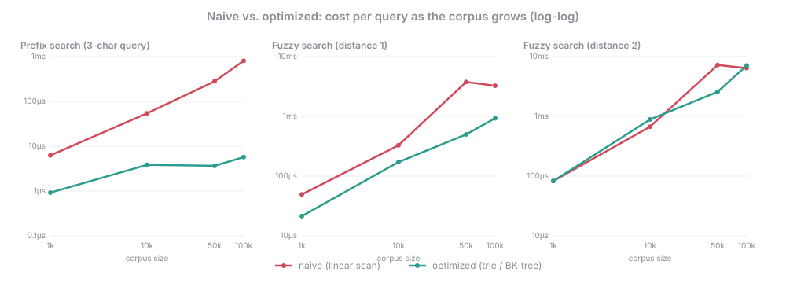

# Benchmark Results

Generated 2026-09-04 by `BenchmarkSuite`. Measured with JMH: 1 fork, 3 warmup iterations, 5 measurement iterations, average time per query, 10 results requested.

`±` is JMH's 99.9% confidence half-width. Each benchmark rotates through 16 queries so no single lucky prefix dominates the average.

## Prefix search — linear scan vs. trie

### Query length 1

| dataset | naive | naive qps | optimized | optimized qps | speedup |
|---:|---:|---:|---:|---:|---:|
| 1,000 | 8.48 µs ±0.29 | 117,900 | 3.51 µs ±0.04 | 284,634 | **2.41×** |
| 10,000 | 86.69 µs ±3.54 | 11,536 | 5.53 µs ±0.18 | 180,676 | **16×** |
| 50,000 | 435 µs ±3.43 | 2,298 | 9.85 µs ±0.55 | 101,528 | **44×** |
| 100,000 | 864 µs ±18.63 | 1,158 | 12.64 µs ±1.60 | 79,093 | **68×** |

### Query length 3

| dataset | naive | naive qps | optimized | optimized qps | speedup |
|---:|---:|---:|---:|---:|---:|
| 1,000 | 4.72 µs ±0.23 | 212,049 | 0.61 µs ±0.01 | 1,637,189 | **7.72×** |
| 10,000 | 58.29 µs ±0.31 | 17,155 | 2.36 µs ±0.02 | 424,210 | **25×** |
| 50,000 | 282 µs ±2.66 | 3,544 | 3.72 µs ±0.05 | 268,623 | **76×** |
| 100,000 | 547 µs ±13.44 | 1,829 | 4.17 µs ±0.06 | 240,086 | **131×** |

### Query length 6

| dataset | naive | naive qps | optimized | optimized qps | speedup |
|---:|---:|---:|---:|---:|---:|
| 1,000 | 3.17 µs ±0.02 | 315,391 | 0.37 µs ±0.00 | 2,705,207 | **8.58×** |
| 10,000 | 102 µs ±2.34 | 9,818 | 0.85 µs ±0.04 | 1,174,835 | **120×** |
| 50,000 | 577 µs ±4.35 | 1,734 | 1.82 µs ±0.02 | 549,458 | **317×** |
| 100,000 | 1,137 µs ±13.64 | 879 | 2.56 µs ±0.04 | 391,269 | **445×** |

## Fuzzy search — linear Levenshtein scan vs. BK-tree

### Max edit distance 1

| dataset | naive | naive qps | optimized | optimized qps | speedup |
|---:|---:|---:|---:|---:|---:|
| 1,000 | 34.57 µs ±1.59 | 28,931 | 22.07 µs ±0.78 | 45,300 | **1.57×** |
| 10,000 | 325 µs ±1.41 | 3,073 | 179 µs ±1.31 | 5,598 | **1.82×** |
| 50,000 | 1,640 µs ±16.47 | 610 | 395 µs ±21.48 | 2,532 | **4.15×** |
| 100,000 | 3,286 µs ±31.89 | 304 | 948 µs ±47.77 | 1,054 | **3.46×** |

### Max edit distance 2

| dataset | naive | naive qps | optimized | optimized qps | speedup |
|---:|---:|---:|---:|---:|---:|
| 1,000 | 68.72 µs ±1.06 | 14,552 | 83.87 µs ±0.47 | 11,923 | **0.82×** |
| 10,000 | 664 µs ±62.06 | 1,505 | 894 µs ±11.96 | 1,118 | **0.74×** |
| 50,000 | 3,201 µs ±17.78 | 312 | 2,673 µs ±28.57 | 374 | **1.20×** |
| 100,000 | 6,361 µs ±53.83 | 157 | 6,809 µs ±81.55 | 147 | **0.93×** |

## End-to-end `search()` — prefix + fuzzy, with progressive relaxation

### Complete misspelled word — worst case, few prefix matches to short-circuit on

| dataset | naive | naive qps | optimized | optimized qps | speedup |
|---:|---:|---:|---:|---:|---:|
| 1,000 | 125 µs ±1.10 | 8,019 | 114 µs ±0.57 | 8,744 | **1.09×** |
| 10,000 | 1,210 µs ±11.26 | 827 | 1,049 µs ±7.95 | 953 | **1.15×** |
| 50,000 | 5,710 µs ±15.30 | 175 | 2,609 µs ±44.84 | 383 | **2.19×** |
| 100,000 | 10,061 µs ±295 | 99 | 6,113 µs ±86.39 | 164 | **1.65×** |

### Partial word, 4 characters — a typical keystroke, prefix short-circuit fires

| dataset | naive | naive qps | optimized | optimized qps | speedup |
|---:|---:|---:|---:|---:|---:|
| 1,000 | 43.10 µs ±1.48 | 23,202 | 23.40 µs ±0.46 | 42,740 | **1.84×** |
| 10,000 | 377 µs ±3.31 | 2,649 | 184 µs ±2.25 | 5,428 | **2.05×** |
| 50,000 | 990 µs ±9.84 | 1,010 | 192 µs ±2.33 | 5,200 | **5.15×** |
| 100,000 | 1,555 µs ±11.59 | 643 | 295 µs ±5.32 | 3,391 | **5.27×** |

